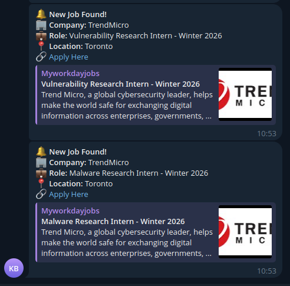

# 🚀 Job Tracker

A Python-based tool to track big-tech job listings from various company career pages, save them to a database, and send notifications via Telegram.

## 🛠️ Installation

To set up the environment, run the following commands:

1. Create the environment:
```bash
conda create --name job_tracker python=3.12 
```
2. Activate the environment:
```bash
conda activate job_tracker
```
3. Install dependencies:
```bash
pip install -r requirements.txt 
```

## 💾 Saving to database

The results are saved into a SQLite 3 database (`data/jobs.db`), 
to check if the job found is new or not. 
The database consists of a single table named `jobs` with the following schema:
```
+------------------------------------------------------+
|                     TABLE: jobs                      |
+----------------+--------------+----------------------+
|  COLUMN NAME   |  DATA TYPE   |       NOTES          |
+----------------+--------------+----------------------+
| 🔑 id          |     TEXT     |  PRIMARY KEY, Unique |
+----------------+--------------+----------------------+
|    title       |     TEXT     |  e.g. "Data Analyst" |
+----------------+--------------+----------------------+
|    company     |     TEXT     |  e.g. "Google"       |
+----------------+--------------+----------------------+
|    location    |     TEXT     |  e.g. "New York, NY" |
+----------------+--------------+----------------------+
|    link        |     TEXT     |  Direct Job URL      |
+----------------+--------------+----------------------+
|    date_added  |     TEXT     |  e.g. 2025/11/28     |
+----------------+--------------+----------------------+
```


## 🔔 Telegram Notification

To enable Telegram notifications, create a `.env` file in the root directory with your telegram credentials (telegram token and telegram chat id) 
and configuration:
```
TELEGRAM_TOKEN=000000000:AAAAAAAAAA-BBBBBBBBBBBBBBBBBBBBBBBB
TELEGRAM_CHAT_ID=-1234567890
DB_PATH=data/jobs.db
```



## ▶️ Running

You can run the script using default keywords defined in the code, or pass specific keywords as arguments.

Basic usage:
```bash
python main.py
```
Run with specific keywords:
```bash
python main.py -k security internship
```

## 🕰️ Automating with Cron

To run the tracker automatically every day at 9:00 AM, add the following line to your crontab:
```
0 8,20 * * * /path/to/your/conda/environment/python3 /path/to/job_tracker/main.py
```


## ⚙️ Config


To track a new company:

1. Create a new python file under the `parsers/` directory (e.g., `parsers/new_company.py`).
2. Implement a class that contains at least these two methods:
    * `build_urls()`: Returns the list of URLs to scrape.
    * `parse()`: Extracts the job data (title, location, link) from the HTML or API response.
3. Add it to the list of parsers in `main.py`
4. Stay alert for new positions!
